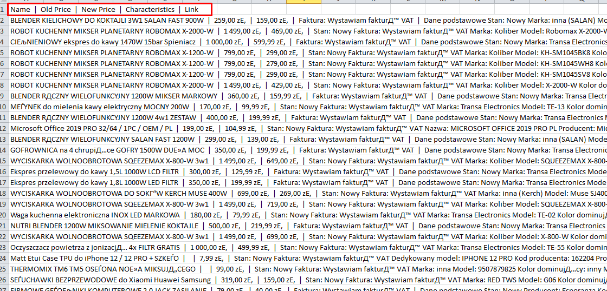

# web-parser

## How it works
* Application parses three categories: Elektronika, Zdorowie, Dom i ogrod
* At the first stage application collects all the links with discount items of one of the category
* Then information about each item is collected
* All the data of discount items is written to `items.csv` file located here `src/main/resources/items.csv`
* Final `items.csv` looks like:

## How to run
* Clone repository from GitHub
* Build the project launching `mvn clean install` from command line
* Launch executable `Web-parser.jar` in `target` folder

## Possible ways of application optimization
* Think about multithreading implementation to shorten time of app running
* Format output to `items.csv` file in accordance to certain logic